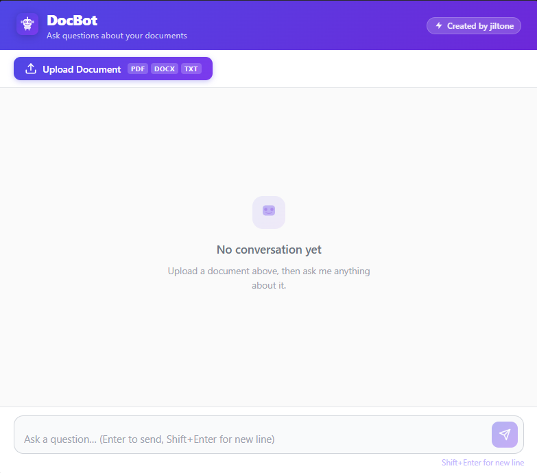

# DocBot — RAG Document Chatbot

A full-stack **Retrieval-Augmented Generation (RAG)** chatbot that lets you upload documents and ask questions about them. Built with FastAPI, ChromaDB, Groq LLM, and React + Vite.



---

## Features

- **Document upload** — supports PDF, DOCX, and TXT files
- **Drag-and-drop** upload with file type badges
- **RAG pipeline** — chunks documents, embeds them locally, and retrieves relevant context before answering
- **Multi-turn conversation** — maintains chat history across messages
- **Source citations** — every answer shows which document chunks it was drawn from
- **Free to run** — uses Groq (free tier LLM) + local sentence-transformers embeddings (no paid API for embeddings)
- **Beautiful UI** — purple/indigo gradient theme, animated typing dots, bot avatar

---

## Tech Stack

| Layer | Technology |
|---|---|
| **Frontend** | React 18, Vite 5, Axios |
| **Backend** | Python 3.13, FastAPI, Uvicorn |
| **Vector Store** | ChromaDB (persistent) |
| **Embeddings** | `all-MiniLM-L6-v2` via sentence-transformers (runs locally) |
| **LLM** | Groq API — `llama-3.1-8b-instant` (free tier) |
| **Document parsing** | pypdf, python-docx, langchain-text-splitters |

---

## Project Structure

```
Chatbot/
├── backend/
│   ├── app/
│   │   ├── main.py          # FastAPI app, /upload and /chat endpoints
│   │   ├── chat.py          # Groq LLM call + prompt building
│   │   ├── ingest.py        # Document parsing, chunking, ChromaDB ingestion
│   │   ├── retriever.py     # Vector similarity search
│   │   ├── config.py        # Settings (reads from .env)
│   │   └── schemas.py       # Pydantic request/response models
│   ├── data/
│   │   ├── uploads/         # Uploaded document files
│   │   └── chroma/          # ChromaDB persistent vector store
│   ├── requirements.txt
│   └── .env                 # API keys (not committed)
└── frontend/
    ├── src/
    │   ├── App.jsx / App.css
    │   ├── api.js
    │   └── components/
    │       ├── ChatWindow.jsx / ChatWindow.css
    │       └── DocumentUpload.jsx / DocumentUpload.css
    ├── index.html
    └── package.json
```

---

## Getting Started

### Prerequisites

- **Python 3.13** (pydantic-core requires ≤ 3.13)
- **Node.js 18+**
- A free **[Groq API key](https://console.groq.com)**

---

### 1. Clone the repository

```bash
git clone https://github.com/your-username/docbot.git
cd docbot
```

### 2. Backend setup

```bash
# Create and activate a virtual environment (Python 3.13)
python -m venv .venv
.venv\Scripts\activate          # Windows
# source .venv/bin/activate     # macOS / Linux

# Install dependencies
pip install -r backend/requirements.txt
```

Create `backend/.env`:

```env
GROQ_API_KEY=your_groq_api_key_here
LLM_MODEL=llama-3.1-8b-instant
```

Start the backend (port 8080):

```bash
uvicorn backend.app.main:app --reload --port 8080
```

### 3. Frontend setup

```bash
cd frontend
npm install
npm run dev
```

Open [http://localhost:5173](http://localhost:5173) in your browser.

---

## Usage

1. Click **Upload Document** (or drag and drop a PDF / DOCX / TXT file)
2. Wait for the "chunks indexed" confirmation
3. Type a question in the input box and press **Enter**
4. DocBot retrieves relevant passages from your document and answers with source citations

---

## API Endpoints

| Method | Path | Description |
|---|---|---|
| `POST` | `/upload` | Upload and index a document |
| `POST` | `/chat` | Send a question with conversation history |
| `GET` | `/health` | Health check |

### POST `/chat` — request body

```json
{
  "question": "What is the main topic of the document?",
  "history": [
    { "role": "user", "content": "..." },
    { "role": "assistant", "content": "..." }
  ]
}
```

---

## Environment Variables

| Variable | Description | Default |
|---|---|---|
| `GROQ_API_KEY` | Your Groq API key | required |
| `LLM_MODEL` | Groq model ID | `llama-3.1-8b-instant` |

---

## Notes

- The first run downloads the `all-MiniLM-L6-v2` embedding model (~90 MB) locally — subsequent starts are instant.
- ChromaDB stores vectors in `backend/data/chroma/` — documents persist across restarts.
- The backend runs on **port 8080** to avoid conflicts with other local services.

---

## License

MIT
